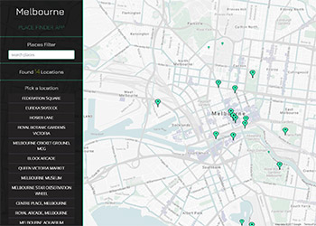

### Frontend Nanodegree Project
___

# Single Page Application Project
### Melbourne Place Finder App

Project to create a single page application. The project should feature a map and places of interest around a local area or area you would like to visit. The application should make use of the **Google Map API** and at least one other **API** of our choosing. The map should feature a place list and search filter and give additional information about these places when selected. The application should be fully responsive across mobile tablet and desktop. The project should use the **Knockout JS** framework and Model, View, Model-View (**MVMV**) pattern for its implementation. (Udacity Neighborhood Map Project)

This is a project from Udacity's **Frontend Nanodegree** [program](https://www.udacity.com/course/front-end-web-developer-nanodegree--nd001).
___



___


## Project Specification

#### Interface design

- Fully responsive
- All application components usable across modern mobile, tablet and desktop browsers.

#### App Functionality

- Filters the list of places and map markers with a text input field or drop down menu.
- Features a list of places that are all displayed by default unless the filter is applied.
- Clicking a list item shows unique information about the place selected and animates its associated map marker.
- All map markers are shown by default and reduced in sync with the place list when the filter is applied.
- The place map markers should display unique information when clicked and they should animate.
- All functionality should run error free including anything extra that is added.

#### App Architecture

- Code is properly separated using **Knockout** best practices following the **MVVM** pattern.
- Avoid updating the **DOM** manually with **jQuery** or **javascript**, instead use **observables** to control the **View**.
- The **Model** features at least 5 locations.

#### Asynchronous Data Usage

- All data requests are retrieved in an asynchronous manner
- Application uses the **Google Maps API** and at least one non-google **API**.
- Data requests that fail are handled gracefully using common fall back techniques (**AJAX error** or **fail** methods)
- Users should be informed with a message when something doesn't load.

#### Location Details Functionality

- Additional place information for locations is provided in the map markers **info window** or in an **HTML** **DOM** element.
- Runs error free.
- Information is presented in a responsive and usable form.
___


## Installation

To run the project please **fork** a copy to your **Git Hub** account and **clone** to your local machine with **Git**.

- Open **index.html** in the browser to view.

### To run Grunt tasks

I've used the **Grunt** task runner to minify / concatenate my code etc. **Please Note** the processed files already exist in the **dist** directory, you only need to run **Grunt** for testing purposes. If you do not have **Node.js** and the **Grunt CLI** running on your system, follow these steps:

### Install Node.js and Grunt CLI

1. To use **Grunt** you will need to have **Node.js** running on your system. [down load node](https://nodejs.org/en/).
2. Change to the project's root directory:
```bash
   cd /example/path/to/project-directory
```
3. Install the projects dependencies (these are listed in the package.json file) by running:
```bash
   npm install
```
4. You then need to have the **Grunt command line interface (CLI)** installed globally. Run the following on Node.js command line:
```bash
   npm install -g grunt-cli
```
5. Continue with step **3** from instructions below:


### You have Node.js and the Grunt CLI

1. Change to the project's root directory (if you are not already in that location):
```bash
   cd /example/path/to/project-directory
```
2. Install the projects dependencies (these are listed in the package.json file) by running:
```bash
   npm install
```
3. Run grunt tasks with:
```bash
   grunt
```

#### Notes:

- Running **grunt** will **delete** the current content of **dist** directory
- Then it will process folders and files in **src** directory and send processed versions to **dist** directory.
- **Please Note** the **dist** directory already contains these processed files. You can run **Grunt** for testing purposes.
- **index.html** in project root is set up to reference the contents of **dist** directory.

See these extra instructions for [getting started with Grunt](https://gruntjs.com/getting-started) (if needed).
___


## API's Used in Project

- **Google Maps API** maps, streetview, places etc.
- **Foursquare API** location data.
- **Fickr API** images.
